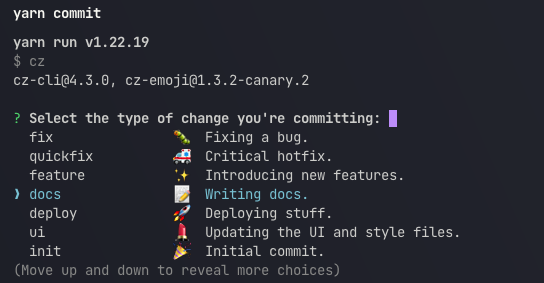

# ModMopet Website
The official website of the ModMopet mod manager.

### 🚧 Under Development
To begin development the following steps are required.

#### Once cloned down install dependencies.
>NOTE: For this example Yarn is being used in place of npm. If you wish to use npm simply replace the yarn commands with npm alternatives. 
```bash
yarn install 
```
#### Start local development server
>NOTE: This will be live on localhost:5173 with hot loading capability
```bash
yarn dev
```
#### Build production code
>NOTE: This will generate a local directory labeled `dist`
```bash
yarn build
```
#### Preview production build
>NOTE: You will need to run the build command before this command to preview the build.
```bash
yarn preview
```
### Helpers 
#### Source Control 
For source control git the current toolset that is being leveraged. With that a commit formatter has also been added for development aid. 
>NOTE: This formatting tool will take you through an interactive prompt to ensure commits are commented and organized properly.
> 
> 

```bash
git add file_for_commit.ext
yarn commit 
```